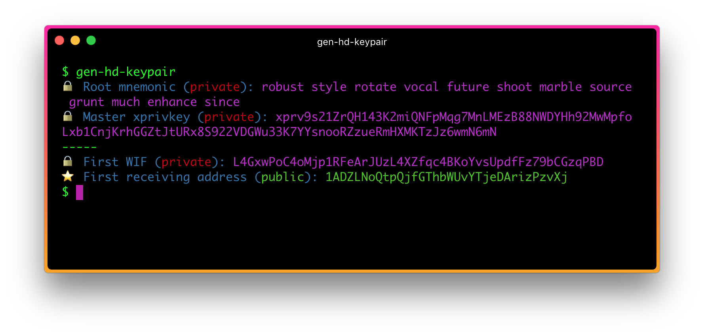

# gen-hd-keypair - Generate a Bitcoin BIP39/BIP44 Keypair 

<p align="center">
  
</p>

Easily generate a Bitcoin master key mnemonic. 

## Example Usage:

```bash
$ gen-hd-keypair 

🔒  Root mnemonic (private): lake effort journey rug stairs embark journey load decline riot dynamic cram
🔒  Master xprivkey (private): xprv9s21ZrQH143K2a6bXRKgyyECju6LHzKo8SbnsEXoYa2f3fgHBLDtc7dPEv63HMfmee7bxaAmhEPDjWhztmDaAwKhQsKAMJuL2EYSQfkzGhe
-----
🔒  First WIF (private): L5JvffBunctw2yfLV6GMD43FJgyNmfNPSZXyAUsPq72VmkjR5xrY
⭐  First receiving address (public): 1NwZRGUTw4khTmuV31EUBBQQv37Zrxi9Uu
```

## Notes for Beginners

If you're relatively new to Bitcoin, note that this *does not* make any external API requests to generate this address. This generates a "keypair" locally using cryptographic functions. That said, you can immediately use these keys on the real Bitcoin network.

It is imperative that you keep the text marked `private` a secret and only share them with parties you trust. 

The public receiving address can be shared freely. You give this address to someone who should send you Bitcoin.

The mnemonic is standard and compatible with "HD wallets" such as [Multibit HD](https://multibit.org). Specifically, the standard used here is BIP44.

## Options 

* `--help` - display the help
* `--json` - display as JSON instead of a console output
* `--mnemonic` - pass your own mnemonic and use it to view the keys

## A Word on Security

As a beginner it can be hard to know if you can trust a command like this that generates keys for you. For example, an evil version of a this program could generate real keys, but secretly store them. When you send funds to the generated address it could then use the generated keys to steal the coins. 

One way to mitigate this is to run this program with your internet turned off. Another would be to inspect the source. 

You can cross-reference that the keys generated by this program are, in fact, standard keys by pasting your mnemonic into [a code converter such as this one](https://iancoleman.github.io/bip39/#english) and comparing that the outputs are the same. Of course, once you have done this, throw away those particular keys because of the reasons given above.

## References

This software uses [bcoin](https://github.com/bcoin-org/bcoin). 

To understand how these keys work see:

* [BIP32](https://github.com/bitcoin/bips/blob/master/bip-0032.mediawiki)
* [BIP39](https://github.com/bitcoin/bips/blob/master/bip-0039.mediawiki)
* [BIP44](https://github.com/bitcoin/bips/blob/master/bip-0044.mediawiki)

## Future Improvements

* Accept a password for the key 
* Derive custom key paths

## License

MIT
